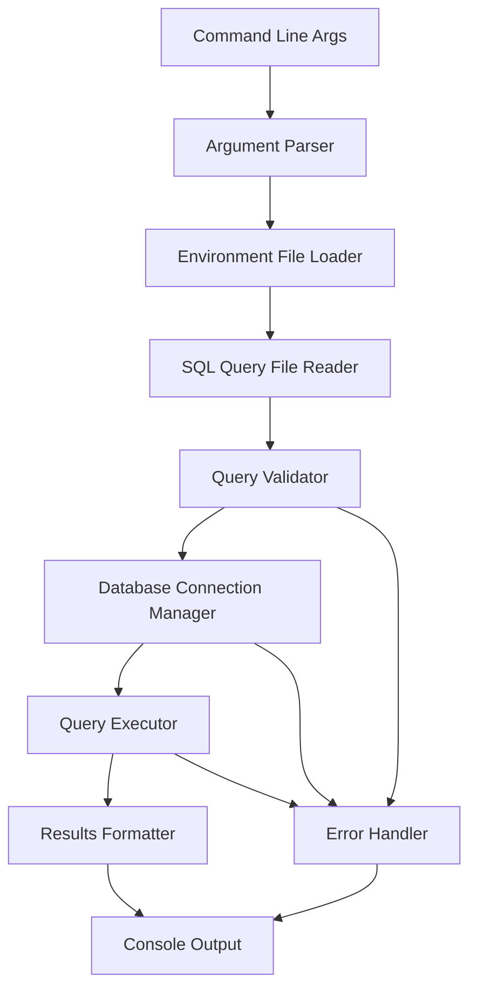
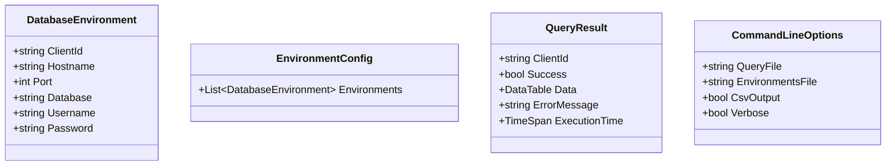

# MultiQuery Implementation Plan

## Project Overview
MultiQuery is a command-line utility that executes SELECT queries against multiple PostgreSQL databases defined in a JSON configuration file. The tool emphasizes safety by enforcing read-only transactions and preventing DML/DDL operations.

## Architecture Overview



## Data Models



## Implementation Phases

### Phase 1: Foundation & Argument Parsing
**Goal**: Set up project structure and handle command-line arguments

**Tasks**:
1. Add required NuGet packages:
   - [`Npgsql`](MultiQuery/MultiQuery.csproj) for PostgreSQL connectivity
   - [`System.CommandLine`](MultiQuery/MultiQuery.csproj) for argument parsing
   - [`System.Text.Json`](MultiQuery/MultiQuery.csproj) for JSON handling

2. Create [`CommandLineOptions`](MultiQuery/Models/CommandLineOptions.cs) class
3. Implement argument parsing with validation:
   - Required: query file path, environments file path
   - Optional: `--csv` flag, `--verbose` flag
4. Add basic error handling and help text
5. **Output**: Display parsed arguments to console for verification

**Acceptance Criteria**:
- `multiquery --help` shows usage information
- `multiquery query.sql envs.json` parses arguments correctly
- `multiquery query.sql envs.json --csv --verbose` handles flags
- Invalid arguments show helpful error messages

### Phase 2: Environment Configuration Loading
**Goal**: Load and validate database environment configurations

**Tasks**:
1. Create [`DatabaseEnvironment`](MultiQuery/Models/DatabaseEnvironment.cs) model class
2. Create [`EnvironmentConfig`](MultiQuery/Models/EnvironmentConfig.cs) wrapper class
3. Implement [`EnvironmentLoader`](MultiQuery/Services/EnvironmentLoader.cs) service:
   - Load JSON file
   - Deserialize to strongly-typed objects
   - Validate required fields
   - Handle file not found and JSON parsing errors
4. **Output**: Display loaded environments (masked passwords) to console

**Acceptance Criteria**:
- Successfully loads [`test-environments.json`](MultiQuery/test-environments.json)
- Validates all required fields are present
- Handles malformed JSON gracefully
- Masks sensitive information in output

### Phase 3: Database Connectivity
**Goal**: Establish connections to PostgreSQL databases

**Tasks**:
1. Create [`DatabaseConnectionManager`](MultiQuery/Services/DatabaseConnectionManager.cs) service
2. Implement connection string building from environment config
3. Add connection testing functionality
4. Implement connection pooling and proper disposal
5. Add timeout handling and retry logic
6. **Output**: Test connection to each database and report status

**Acceptance Criteria**:
- Successfully connects to available databases
- Reports connection failures with meaningful messages
- Properly disposes of connections
- Handles network timeouts gracefully

### Phase 4: SQL Query File Processing
**Goal**: Read and validate SQL query files

**Tasks**:
1. Create [`QueryFileReader`](MultiQuery/Services/QueryFileReader.cs) service
2. Implement file reading with encoding detection
3. Create [`QueryValidator`](MultiQuery/Services/QueryValidator.cs) service:
   - Ensure only SELECT statements are allowed
   - Block DML operations (INSERT, UPDATE, DELETE)
   - Block DDL operations (CREATE, ALTER, DROP)
   - Handle multi-statement queries
4. **Output**: Display loaded query content and validation results

**Acceptance Criteria**:
- Reads SQL files with various encodings
- Rejects non-SELECT queries with clear error messages
- Handles empty files and comments properly
- Supports multi-line queries

### Phase 5: Query Execution Engine
**Goal**: Execute queries against databases with safety constraints

**Tasks**:
1. Create [`QueryExecutor`](MultiQuery/Services/QueryExecutor.cs) service
2. Implement read-only transaction handling:
   - Set transaction isolation level to READ COMMITTED
   - Ensure transaction is read-only
3. Add query execution with timeout
4. Implement result set capture using `DataTable`
5. Add execution timing and performance metrics
6. **Output**: Execute a simple test query (e.g., `SELECT 1 as test`) against all databases

**Acceptance Criteria**:
- Executes queries in read-only transactions
- Captures complete result sets
- Handles query timeouts appropriately
- Records execution metrics

### Phase 6: Results Processing & Formatting
**Goal**: Format and display query results

**Tasks**:
1. Create [`ResultsFormatter`](MultiQuery/Services/ResultsFormatter.cs) service
2. Implement table formatting for console output:
   - Column alignment
   - Header formatting
   - Row separation
3. Implement CSV formatting:
   - Proper escaping of special characters
   - Header row inclusion
4. Add result aggregation across environments
5. **Output**: Display formatted results from test query execution

**Acceptance Criteria**:
- Console output is readable and well-formatted
- CSV output is properly escaped and valid
- Results are clearly separated by environment
- Handles null values and special characters

### Phase 7: Error Handling & Logging
**Goal**: Comprehensive error handling and user feedback

**Tasks**:
1. Create [`ErrorHandler`](MultiQuery/Services/ErrorHandler.cs) service
2. Implement structured error handling:
   - Database connection errors
   - Query execution errors
   - File I/O errors
   - Validation errors
3. Add verbose logging option
4. Implement graceful degradation (continue with other databases if one fails)
5. **Output**: Test error scenarios and verify appropriate error messages

**Acceptance Criteria**:
- All error types are handled gracefully
- Error messages are user-friendly and actionable
- Verbose mode provides detailed diagnostic information
- Application continues processing other databases when possible

### Phase 8: Integration & Performance Testing
**Goal**: End-to-end testing and performance optimization

**Tasks**:
1. Create comprehensive test queries
2. Test against all database environments
3. Performance testing and optimization:
   - Parallel execution for multiple databases
   - Memory usage optimization for large result sets
   - Connection pooling efficiency
4. Add progress indicators for long-running operations
5. **Output**: Execute real queries against multiple databases and measure performance

**Acceptance Criteria**:
- Successfully executes queries against all available databases
- Performance is acceptable for typical use cases
- Memory usage is reasonable for large result sets
- Progress feedback is provided for long operations

### Phase 9: Documentation & Final Polish
**Goal**: Complete documentation and final refinements

**Tasks**:
1. Create comprehensive README with usage examples
2. Add inline code documentation
3. Create sample query files for testing
4. Final code review and refactoring
5. Add version information and build metadata
6. **Output**: Complete, documented, and tested application

**Acceptance Criteria**:
- All code is well-documented
- README includes clear usage instructions and examples
- Sample files are provided for testing
- Application handles edge cases gracefully

## Technical Specifications

### Command Line Interface
```bash
# Basic usage
multiquery query.sql test-environments.json

# CSV output
multiquery query.sql test-environments.json --csv

# Verbose output
multiquery query.sql test-environments.json --verbose

# Redirect to file
multiquery query.sql test-environments.json --csv > results.csv
```

### Safety Features
- **Read-only transactions**: All queries execute in read-only transaction mode
- **Query validation**: Only SELECT statements are permitted
- **Connection timeouts**: Prevent hanging connections
- **Error isolation**: Failure in one database doesn't stop processing others

### Output Formats
- **Console (default)**: Formatted tables with headers and alignment
- **CSV (--csv flag)**: Comma-separated values with proper escaping
- **Verbose mode**: Additional diagnostic information and timing

### Dependencies
- **.NET 8.0**: Target framework
- **Npgsql**: PostgreSQL database provider
- **System.CommandLine**: Command-line argument parsing
- **System.Text.Json**: JSON serialization/deserialization

### Project Structure
```
MultiQuery/
├── Models/
│   ├── CommandLineOptions.cs
│   ├── DatabaseEnvironment.cs
│   ├── EnvironmentConfig.cs
│   └── QueryResult.cs
├── Services/
│   ├── DatabaseConnectionManager.cs
│   ├── EnvironmentLoader.cs
│   ├── ErrorHandler.cs
│   ├── QueryExecutor.cs
│   ├── QueryFileReader.cs
│   ├── QueryValidator.cs
│   └── ResultsFormatter.cs
├── Program.cs
└── MultiQuery.csproj
```

## Implementation Notes

### Security Considerations
- Passwords are masked in console output
- Connection strings are not logged in verbose mode
- Read-only transactions prevent accidental data modification
- Query validation prevents SQL injection through file content

### Performance Considerations
- Connection pooling for efficient database access
- Parallel execution for multiple databases (Phase 8)
- Streaming results for large datasets
- Memory-efficient result processing

### Error Handling Strategy
- Graceful degradation: continue processing other databases if one fails
- Detailed error messages with context
- Verbose mode for debugging
- Proper resource cleanup on errors

This phased approach ensures that each component is built incrementally, tested thoroughly, and integrates properly with the overall system. Each phase has clear deliverables and acceptance criteria, making it easy to track progress and ensure quality.