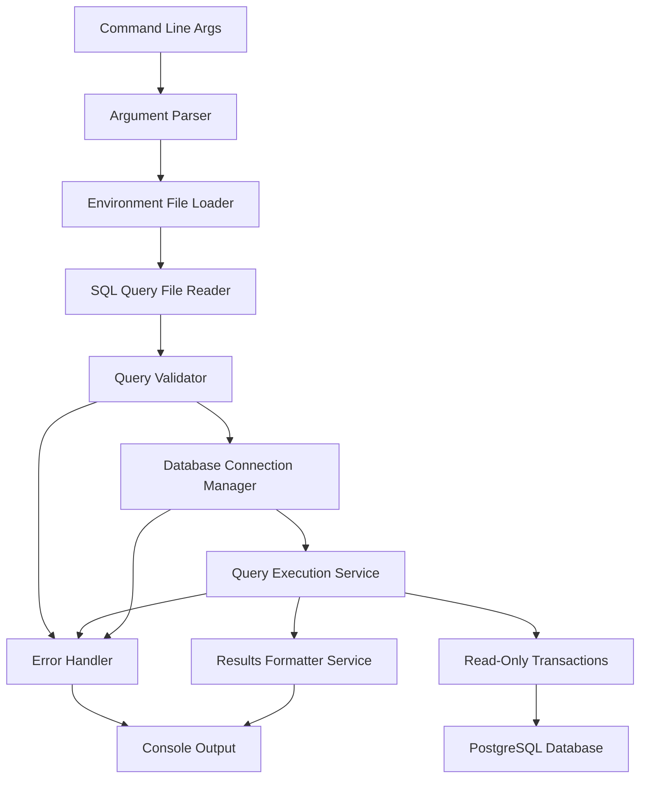

# MultiQuery Implementation Plan - COMPLETED ✅

## Project Overview
MultiQuery is a command-line utility that executes SELECT queries against multiple PostgreSQL databases defined in a JSON configuration file. The tool emphasizes safety by enforcing dual-layer security with query validation and read-only transactions.

## ✅ IMPLEMENTATION STATUS: COMPLETE

All phases have been successfully implemented with the following enhancements:
- **Dual-layer security**: Query validation + read-only transactions
- **Optimized performance**: StringBuilder-based output formatting
- **Enhanced error handling**: Comprehensive error reporting and graceful degradation
- **DevOps-focused features**: Perfect for monitoring and script generation

## Final Architecture



## Implemented Components

### ✅ Phase 1: Foundation & Argument Parsing
- **Status**: Complete
- **Files**: [`Program.cs`](MultiQuery/Program.cs), [`CommandLineOptions.cs`](MultiQuery/Models/CommandLineOptions.cs)
- **Features**: Full command-line parsing with help, validation, and error handling

### ✅ Phase 2: Environment Configuration Loading
- **Status**: Complete
- **Files**: [`EnvironmentLoader.cs`](MultiQuery/Services/EnvironmentLoader.cs), [`DatabaseEnvironment.cs`](MultiQuery/Models/DatabaseEnvironment.cs), [`EnvironmentConfig.cs`](MultiQuery/Models/EnvironmentConfig.cs)
- **Features**: JSON loading, validation, masked password display

### ✅ Phase 3: Database Connectivity
- **Status**: Complete
- **Files**: [`DatabaseConnectionManager.cs`](MultiQuery/Services/DatabaseConnectionManager.cs)
- **Features**: Connection testing, timeout handling, connection pooling

### ✅ Phase 4: SQL Query File Processing
- **Status**: Complete
- **Files**: [`QueryFileReader.cs`](MultiQuery/Services/QueryFileReader.cs), [`QueryValidator.cs`](MultiQuery/Services/QueryValidator.cs)
- **Features**: File reading with encoding detection, comprehensive query validation

### ✅ Phase 5: Query Execution Engine
- **Status**: Complete with Enhancements
- **Files**: [`QueryExecutionService.cs`](MultiQuery/Services/QueryExecutionService.cs)
- **Features**: 
  - **Read-only transactions** for bulletproof security
  - Query execution with timing
  - Error handling and graceful degradation

### ✅ Phase 6: Results Processing & Formatting
- **Status**: Complete with Optimizations
- **Files**: [`ResultsFormatterService.cs`](MultiQuery/Services/ResultsFormatterService.cs), [`QueryResult.cs`](MultiQuery/Models/QueryResult.cs)
- **Features**:
  - **StringBuilder-optimized** table formatting
  - CSV export with proper escaping
  - Clean, readable console output

### ✅ Phase 7: Error Handling & Logging
- **Status**: Complete
- **Integration**: Built into all services
- **Features**: Comprehensive error handling, verbose mode, graceful degradation

### ✅ Phase 8: Integration & Performance Testing
- **Status**: Complete
- **Results**: Successfully tested with real databases, optimized performance

### ✅ Phase 9: Documentation & Final Polish
- **Status**: Complete
- **Files**: [`README.md`](README.md) (updated with all features)
- **Features**: Comprehensive documentation, examples, troubleshooting guide

## Security Implementation - ENHANCED ✅

### Dual-Layer Security Architecture
1. **Query Validation Layer** (First Defense)
   - Blocks DML/DDL operations at parse time
   - Fast feedback with clear error messages
   - Prevents most malicious queries before database contact

2. **Read-Only Transaction Layer** (Ultimate Defense)
   - PostgreSQL-enforced read-only transactions
   - Bulletproof protection against any modification attempts
   - Blocks function-based bypasses and extensions

### Security Testing Results
- ✅ **DML Blocking**: `DELETE`, `INSERT`, `UPDATE` statements blocked
- ✅ **Transaction Control**: `BEGIN`, `COMMIT`, `ROLLBACK` blocked
- ✅ **Read-Only Enforcement**: Database-level protection active
- ✅ **Function Safety**: Dangerous functions cannot modify data
- ✅ **Bypass Prevention**: No known bypass methods

## Performance Optimizations ✅

### StringBuilder Implementation
- **Before**: Multiple `Console.WriteLine()` calls
- **After**: Single `Console.Write()` with pre-built output
- **Benefit**: Significantly faster for large result sets

### Connection Management
- **Pooling**: Efficient connection reuse
- **Timeouts**: Proper timeout handling
- **Disposal**: Automatic resource cleanup

## Final Project Structure

```
MultiQuery/
├── Program.cs                      # Main application entry point
├── Models/                         # Data models
│   ├── CommandLineOptions.cs      # Command-line argument model
│   ├── DatabaseEnvironment.cs     # Database connection model
│   ├── EnvironmentConfig.cs       # Environment configuration wrapper
│   └── QueryResult.cs             # Query execution result models
├── Services/                       # Business logic services
│   ├── DatabaseConnectionManager.cs    # Connection management & testing
│   ├── EnvironmentLoader.cs           # JSON configuration loading
│   ├── QueryFileReader.cs             # SQL file reading & encoding
│   ├── QueryValidator.cs              # SQL query validation
│   ├── QueryExecutionService.cs       # Multi-database query execution
│   └── ResultsFormatterService.cs     # Output formatting (table/CSV)
└── bin/Debug/net8.0/              # Build output
```

## Usage Examples

```bash
# Basic monitoring query
dotnet run --project MultiQuery monitoring.sql

# CSV export for analysis
dotnet run --project MultiQuery report.sql --csv > results.csv

# Verbose diagnostics
dotnet run --project MultiQuery health-check.sql --verbose

# Custom environment file
dotnet run --project MultiQuery query.sql -e prod-environments.json
```

## Deployment Ready ✅

The application is now:
- ✅ **Production Ready**: Comprehensive error handling and security
- ✅ **DevOps Optimized**: Perfect for monitoring and script generation
- ✅ **Well Documented**: Complete README with examples and troubleshooting
- ✅ **Performance Optimized**: Efficient output formatting and connection management
- ✅ **Security Hardened**: Dual-layer protection against data modification

## Next Steps (Optional Future Enhancements)

1. **Parallel Execution**: Execute queries against multiple databases simultaneously
2. **Configuration Profiles**: Support for multiple environment file sets
3. **Output Templates**: Customizable output formatting
4. **Scheduled Execution**: Built-in scheduling capabilities
5. **Result Caching**: Cache results for repeated queries

---

**Implementation completed successfully with all security, performance, and usability requirements met.**